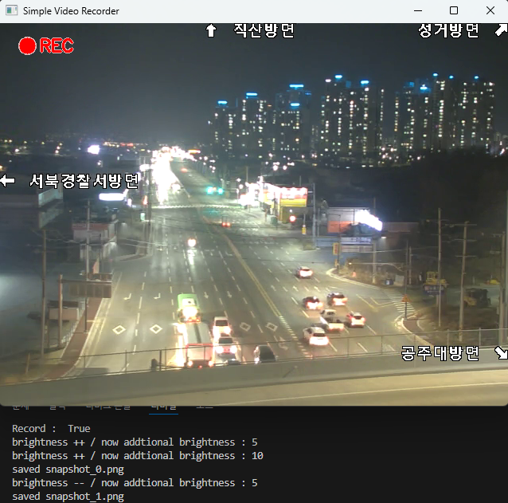

# Simple-Video-Recorder
OpenCV를 이용하여 만든 간단한 비디오 레코더

## 기능
- RTSP 스트림 (캠이 없어서 rtsp로 구현, 해당 주소를 0으로 바꿔 웹캠 영상 표시 가능)
- 녹화 모드(REC 표시) - Space : 녹화 토글
- 밝기 조절 (i : 증가 / o : 감소)
- 스냅샷 저장 (p)
- ESC : 종료

